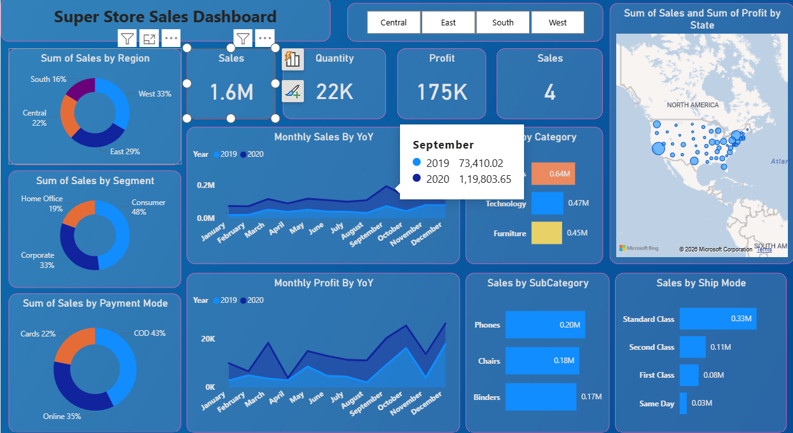
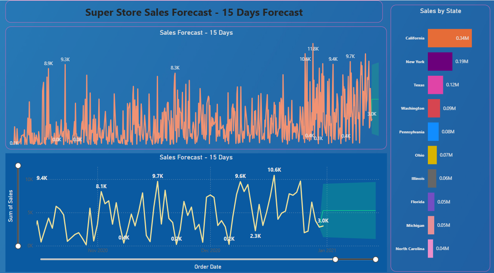

# Super Store Sales Dashboard

## Project Overview

This project is an interactive Power BI dashboard developed using the Super Store Sales dataset. It provides insights into sales, profit, quantity, customer segments, shipping modes, and includes a 15-day sales forecast.

---

## Tools Used

- Power BI
- Power Query
- DAX
- Microsoft Excel

---

## Dashboard Features

- Sales KPI
- Profit KPI
- Quantity KPI
- Regional Analysis
- State-wise Sales
- Customer Segment Analysis
- Payment Mode Analysis
- Category & Sub-category Analysis
- Monthly Sales Trend
- Monthly Profit Trend
- Interactive Filters
- 15-Day Sales Forecast

---

## Key Insights

- California generated the highest sales.
- Consumer segment contributed the highest revenue.
- Standard Class shipping was used most frequently.
- Technology was the highest-selling category.
- The forecast predicts stable sales for the next 15 days.

---

## Screenshots

### Dashboard

### Forecast

---

## Author

Vakiti Yashwanth Reddy
